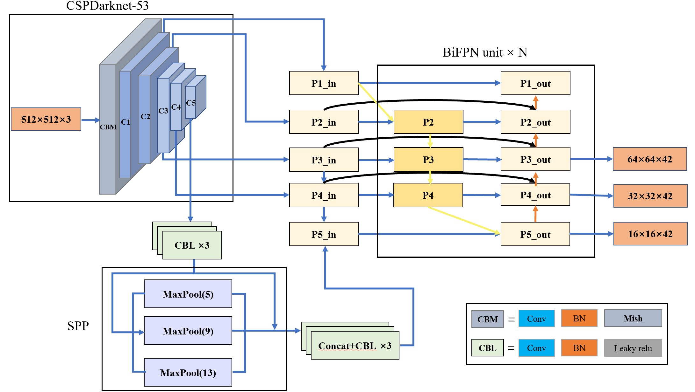

# improved yolov4

## overview

## getting started

our project was based on this: https://github.com/bubbliiiing/yolov4-pytorch.git, you can tap this link to know more information about installing independence, training and testing.

## dataset

